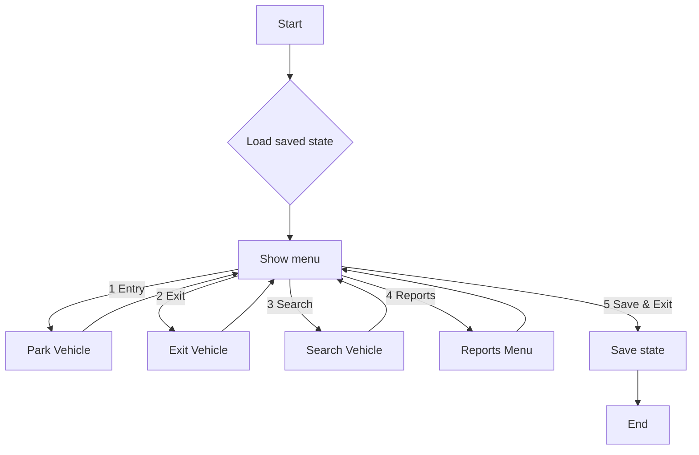
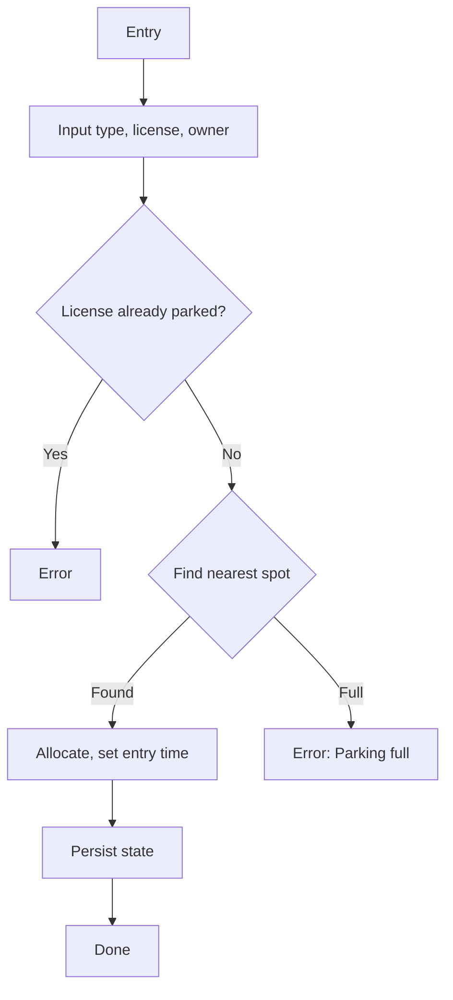
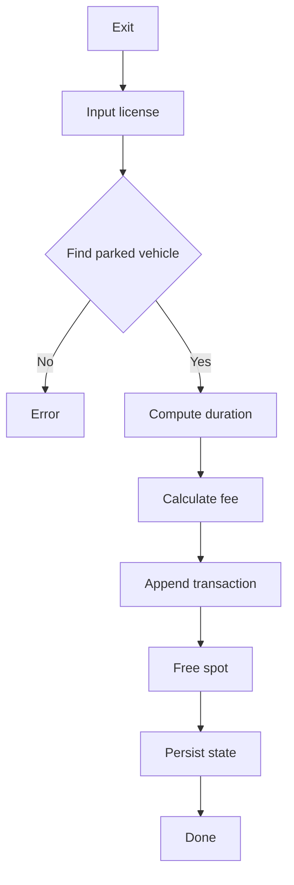
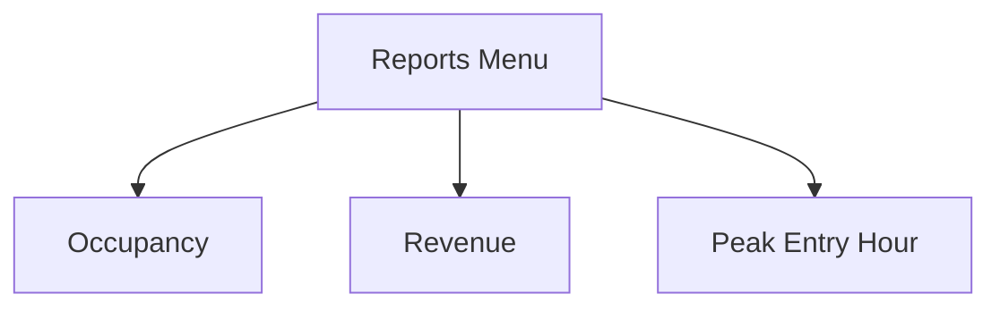

# Smart Parking System - Design

This document describes the system design, data models, flowcharts, and algorithms used for the C and C++ implementations of the Smart Parking System.

## Parking Structure
- 5 floors, 20 parking spots per floor
- Vehicle types: Bike, Car, Truck
- Pricing: First hour + additional per-hour (rounded up)

## Data Models

### C (structs)
- Vehicle
  - license: char[32]
  - owner: char[64]
  - entryTime: time_t
  - type: enum VehicleType { Bike, Car, Truck }
  - floor: int
  - spot: int
- ParkingSpot
  - occupied: int
  - vehicle: Vehicle* (malloc/free)

### C++ (classes)
- Vehicle (base)
  - license: string
  - owner: string
  - entryTime: time_t
  - type: VehicleType (enum class)
  - floor, spot: int
  - virtual methods for rateFirstHour(), rateAddHour()
- Derived: Bike, Car, Truck override pricing
- ParkingSpot holds unique_ptr<Vehicle>

### Files (CSV)
- C: `data-c/parking_state.csv`, `data-c/transactions.csv`
- C++: `data-cpp/parking_state.csv`, `data-cpp/transactions.csv`

## Smart Allocation Algorithm
- Nearest to the entrance is defined as floor 0, spot 0, scanning row-major:
  - For f in 0..4
    - For s in 0..19
      - If spot free -> allocate
- Complexity: O(F*S) per allocation (here at most 100 checks)

## Billing Algorithm
- durationHours = ceil(durationMinutes / 60)
- First hour rate by type; additional rate per extra hour
- Fee = firstHour if durationHours==1 else firstHour + (durationHours-1) * addHour

## Flowcharts

### Main Menu

### Vehicle Entry

### Vehicle Exit

### Reports

## Error Handling and Edge Cases
- Empty inputs rejected for license/owner
- Duplicate license detection on entry
- Minimum duration billed: 1 minute; hours rounded up
- File I/O failures logged as warnings; operations continue

## Complexity
- Entry allocation: O(F*S)
- Exit/search: O(F*S)
- Reports: O(number of transactions + F*S)

## Persistence Strategy
- Parking state saved after every mutation and on exit
- Transactions appended-only with a header line

